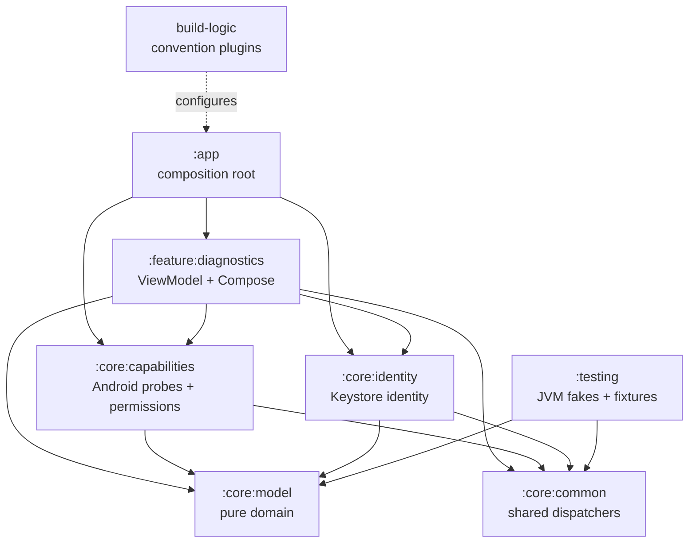

# SpatialLink P0 Foundation and P1 Identity

## Purpose

P0 establishes a launchable, offline-first Android foundation for local
capability and permission diagnostics. It reports what the current platform
exposes without creating identity, discovering peers, connecting to another
device, transferring data, or starting a ranging session. The bounded P1
extension adds local cryptographic device identity only. P2 adds the separate,
anonymous BLE discovery boundary described below and is complete
(P2_BLE_DISCOVERY_COMPLETE). P3 Task 1 source exists but is BLOCKED
(P3_IMPLEMENTATION_BLOCKED_PROVIDER_MATRIX); Task 2 is not started. P4 and
later remain out of scope.

## Module graph and dependency direction



`:core:model` has no Android, Compose, Activity, Context, or ViewModel dependency. Android service access is isolated in injected adapters and probes under `:core:capabilities`. UI code consumes state and does not call platform services. `:app` constructs concrete dependencies once in an explicit application container.

### P2 module boundary

    :app
    ├── :feature:nearby
    │   ├── :core:designsystem
    │   ├── :core:discovery
    │   └── :connectivity:ble
    ├── :feature:diagnostics
    │   └── :core:designsystem
    ├── :core:discovery
    └── :connectivity:ble ──> :core:discovery

core:discovery is pure Kotlin and contains no Android framework access.
connectivity:ble is the typed Android boundary for the scanner, advertiser,
Bluetooth state, and discovery permission inspection. feature:nearby and
feature:diagnostics have no feature-to-feature dependency; their shared
presentation infrastructure is the neutral core:designsystem. P2 has no
dependency on core:identity and never broadcasts P1 identity material.

## Offline and privacy invariants

P0 has no HTTP client, socket, Firebase, analytics, telemetry, cloud,
database, ML, or remote configuration dependency. No current code performs
networking despite the future-reserved `INTERNET` declaration. P0 does not
read MAC addresses, serials, IMEI, device identifiers, personal content, or
physical location. P1 persists only a Keystore-backed private key under its
fixed application alias; it does not persist personal content, peer state, or
physical observations.

The manifest disables backup and supplies explicit empty legacy and modern backup/transfer rules, so P0 data is excluded from both backup mechanisms.

## Capability model

Each spatial and ranging observation is `AVAILABLE`, `UNAVAILABLE`, or `UNKNOWN`. Missing hardware is `UNAVAILABLE` and is not an error. A feature absence is therefore safe for emulators and devices without NFC, UWB, Wi-Fi Aware, Wi-Fi RTT, or BLE advertising support.

Four injected probe families inspect Bluetooth, Wi-Fi, NFC/UWB, and unified platform ranging. `AndroidDeviceCapabilityDetector` runs them in a supervisor scope. A failed subsystem returns unknown values for its declared keys and one stable `CapabilityIssue`; successful sibling results remain in the assembled `DeviceCapabilities` snapshot.

Duplicate observations aggregate with `AVAILABLE` taking precedence, then `UNKNOWN`, then `UNAVAILABLE`. `FoundationStatus` is `READY` when all observations are known and there are no issues, `PARTIAL` for unknown observations or recoverable issues, and `ERROR` only for a missing snapshot or explicit fatal failure.

## Permission architecture

The pure permission policy models `BLUETOOTH_SCAN`, `BLUETOOTH_ADVERTISE`, and `BLUETOOTH_CONNECT` from API 31; `NEARBY_WIFI_DEVICES` from API 33; `RANGING` from API 36; and `ACCESS_LOCAL_NETWORK` from OS API 37 when the target SDK is at least 37. `PermissionSnapshot` exposes `bluetoothScan`, `bluetoothAdvertise`, `bluetoothConnect`, `nearbyWifi`, `localNetwork`, and `ranging`.

The state space is `GRANTED`, `DENIED`, `NOT_REQUIRED_ON_THIS_OS`, `NOT_DECLARED`, or `UNKNOWN`. The Android reader applies the pure API policy before checking the declared permission set and then grant state. Each check is isolated behind `PermissionPlatformAccess`, and no runtime request is made by P0.

## P1 cryptographic identity boundary

`:core:model` remains pure Kotlin. It owns `SpatialDeviceId`, whose exact
32-byte value is SHA-256 of the X.509 SubjectPublicKeyInfo encoding of the
identity public key, plus typed identity algorithms, security levels, results,
failures, and repository contracts. JDK standard-library `MessageDigest` is
the only hashing implementation in the model; no Android or external crypto
provider leaks into it.

`:core:identity` is the only Android identity module. Its injected
`IdentityKeyStorePort` keeps Android Keystore and JCA operations outside the
repository orchestration tests. The production adapter generates EC
`secp256r1` material with `PURPOSE_SIGN`, SHA-256 ECDSA, authentication not
required, no StrongBox request, and no attestation request. The private key is
never exported. The identity ID is derived only from the encoded public key;
it never uses UUIDs, Android ID, serials, IMEI, MAC/Bluetooth addresses,
accounts, manufacturer, or model values.

The fixed production alias is
`spatiallink.identity.signing.v1`. `get()` never creates a key. `getOrCreate()`
holds one coroutine `Mutex` across the missing check and generation, so
concurrent callers cannot rotate or duplicate the identity. Existing invalid
entries are reported as typed failures and are not deleted or silently
replaced. Each inspection performs a random in-memory sign/verify self-test;
modified payloads reject, and self-test failure maps to recovery-required
without destructive recovery.

API 31+ security inspection uses the typed `KeyInfo.securityLevel` reader;
API 29–30 uses typed `isInsideSecureHardware` fallback and reports
`UNKNOWN_SECURE` where the legacy signal cannot distinguish hardware classes.
Security-level uncertainty does not invalidate an otherwise valid identity.
The diagnostics UI exposes only status, short ID, algorithm, key protection,
and self-test state.

The manifest declares legacy Bluetooth permissions capped at API 30, modern Bluetooth permissions with the required `neverForLocation` flag on scanning, Wi-Fi state/change permissions, `NEARBY_WIFI_DEVICES` with `neverForLocation`, legacy fine location capped at API 32, `ACCESS_LOCAL_NETWORK`, NFC, RANGING, and the future-reserved INTERNET permission. No broad storage permission or required hardware feature is declared.

## P2 anonymous discovery protocol and privacy boundary

P2 uses the fixed service-data UUID
7F83C58D-4C4B-4E97-9B7D-9C06D3A47B91 and an exact nine-byte v1 payload:
byte 0 is 0x01; bytes 1..8 are the 64-bit big-endian DiscoverySessionId.
SecureRandom generation rejects all-zero and retries within a defensive
bound. Exhausting that bound produces the typed
SESSION_ID_GENERATION_FAILED result. One token exists only for one 30-second
foreground session, is held in RAM, and is never persisted or logged.

The non-connectable legacy AdvertiseData contains only the UUID service-data
AD structure: 1 byte length, 1 byte type, 16 byte UUID, and 9 byte payload,
for 27 bytes of SpatialLink-owned structure. The final legacy advertisement
must be <= 31 bytes. No exact 30-byte physical total is asserted and P2
never falls back to extended advertising. Device name, TX power, manufacturer
data, duplicate UUID, capability bitmap, identity material, and scan response
are excluded.

| Operation | Required permission | BLUETOOTH_CONNECT |
| --- | --- | --- |
| Discovery scan while Bluetooth is already enabled | BLUETOOTH_SCAN | Not required |
| Non-connectable legacy advertisement | BLUETOOTH_ADVERTISE | Not required |
| Bluetooth enable or another verified connect-gated action | Action-specific | Only if the running API requires it |

The scanner uses a fixed service-data filter and reads only service data,
RSSI, and monotonic receipt time from each scan result. It does not access
ScanResult.device, Bluetooth address, name, alias, bond state, or
ScanResult.toString(). A valid frame is anonymous and UNVERIFIED; P2 does not
broadcast SpatialDeviceId or a public key and does not depend on
core:identity.

Each owner-scoped discovery controller owns the session token, peer cache,
scanner, advertiser, timer, and cleanup coordinator. Discovery is
foreground-only: leaving the Nearby surface stops the session before
navigation, ON_STOP stops it without automatic restart, and active ticks
re-check required scan/advertise permissions and Bluetooth enabled state.
Scanner startup precedes advertiser startup; a partial-start failure rolls
back the first handle. Cleanup is serialized and exactly once per handle,
clears ephemeral state before terminal publication, and cannot be stolen by a
second start. The cache is RAM-only, expires peers after six seconds, and is
bounded to 64 entries. RSSI is not converted into distance or direction.

Qualification requires two authorized physical devices for
P2_BLE_DISCOVERY_COMPLETE: each device must observe the other bidirectionally,
both peers must remain UNVERIFIED, and stop/restart must clear peers and
create fresh session tokens without exposing identity, address, name, model,
or raw token data. That two-device qualification completed on 2026-08-29:
API 34 serial b294f127 and API 30 selector 192.168.0.103:35415 (not the mDNS
alias) each observed one anonymous UNVERIFIED presence. Device B connected
XML was non-zero. Status: P2_BLE_DISCOVERY_COMPLETE.

## API 29–37 strategy

The project compiles against SDK 37, targets SDK 37, and runs from API 29. Old paths use literal feature names and guarded typed adapters. API 29–35 return an unsupported platform-ranging capability without touching `android.ranging.*`; legacy fallback derives UWB from the UWB package feature on API 31+, BLE RSSI from Bluetooth LE, and Wi-Fi NAN RTT from the conjunction of Wi-Fi Aware and Wi-Fi RTT. BLE Channel Sounding and Wi-Fi Proximity Detection remain unavailable before their unified API support.

The base UWB capability is always a platform `PackageManager` feature observation. P0 does not add `androidx.core.uwb`.

## Ranging API isolation and lifecycle

API 36+ detailed inspection is isolated in `@RequiresApi(36)` typed sources. `Api36RangingTechnologyIds` contains only API 36 `RangingManager` constants. The API 37-only `WIFI_PD` field is contained in `@RequiresApi(37)` `Api37RangingTechnologyIds` and is passed into the API 36 probe only after an OS-level guard.

`Api36RangingCapabilitySource` obtains a `RangingManager`, uses the application context's main executor, registers one `RangingCapabilitiesCallback`, and awaits its asynchronous availability map through `CancellableRangingCapabilityReader`. The bridge installs cancellation cleanup before registration, copies callback maps, unregisters before completing the first result, and guards unregister with an atomic one-shot gate. Registration failure, callback failure, and cancellation all reach cleanup without retaining a continuation or callback. The adapter never invokes `createRangingSession()`.

Status mapping recognizes enabled, unsupported, and disabled states. Unknown platform statuses become `UNKNOWN` with a typed issue. An empty successful map means unavailable; a service or callback failure means unknown for the affected detailed inspection. The typed unsupported adapter handles API <36 safely.

## Test strategy

The JVM tests prove capability aggregation precedence, hardware absence, legacy
fallback, API boundary permission policy, typed permission mapping, partial
probe failures, cancellation propagation, typed ranging status mapping,
callback completion/cancellation, exact-once unregister, identity ID
immutability, identity invariants, repository no-rotation/concurrency/
cancellation/self-test policies, reducer behavior, ViewModel sibling
preservation, and no raw exception in UI state. Compose/instrumentation tests
verify the launch title, capability/ranging/permission/identity rows,
foundation status, Keystore signing and modified-payload rejection, identity
persistence across repository instances, and activity recreation without
assuming optional hardware exists.

## P0 limitations and future phase boundaries

P0 inspects a snapshot at launch. It does not monitor platform state changes,
request permissions, discover peers, establish trust, negotiate a session,
transfer files, persist physical location, or prove end-to-end support on a
particular physical device. The bounded P1 identity implementation is listed
below. P2 is complete (P2_BLE_DISCOVERY_COMPLETE). P3 Task 1 source exists
but is BLOCKED (P3_IMPLEMENTATION_BLOCKED_PROVIDER_MATRIX); Task 2 is not
started. P4–P13 remain future phases:

```text
P1  Cryptographic Device Identity (bounded local Keystore foundation)
P2  BLE Peer Discovery (P2_BLE_DISCOVERY_COMPLETE)
P3  Secure Peer Handshake (P3_IMPLEMENTATION_BLOCKED_PROVIDER_MATRIX; Task 2 not started)
P4  High-Speed Local Transport
P5  Chunked Resumable Transfer
P6  NFC Physical Trust
P7  Android Spatial Ranging
P8  Point-to-Device Targeting
P9  Smart Capsules
P10 Local Semantic Index
P11 Semantic Share / Smart Pull
P12 Multi-Device Spatial Workspace
P13 Local Swarm Transfer
```
