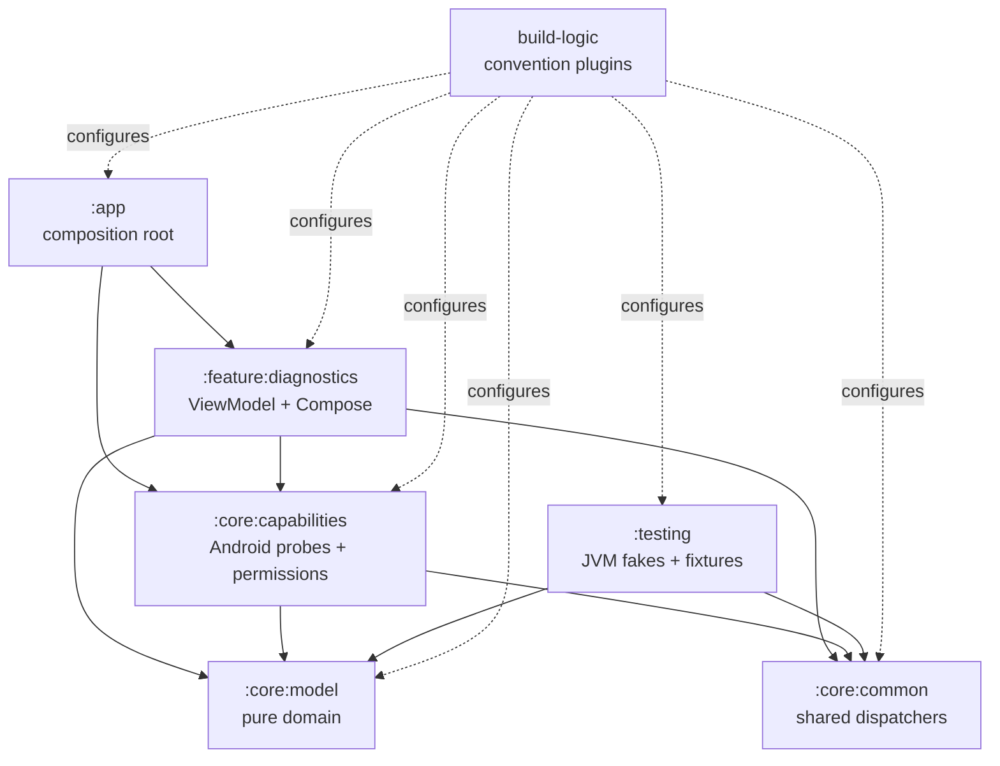

# SpatialLink P0 Foundation Design

**Date:** 2026-08-27  
**Status:** Approved in the current task before implementation  
**Target checkout:** `E:\Projects\R2H-Android\R2H-SpatialLink`

## 1. Purpose and scope

P0 establishes the offline-first Android foundation for SpatialLink. It proves that the application can build, launch, inspect the local platform, expose typed capability and permission state, and render a diagnostic Compose screen across the supported API range.

P0 stops at inspection and presentation. It does not create an identity, discover peers, establish trust, transfer files, start a ranging session, persist physical location, or add any semantic-AI or workspace behavior.

The application ID and Kotlin namespace are both `com.r2h.spatiallink`.

## 2. Locked platform baseline

The build uses the versions specified by the approved master prompt:

| Item | Version |
| --- | --- |
| Minimum Android API | 29 |
| Compile Android API | 37 |
| Target Android API | 37 |
| JDK/toolchain | 17 |
| Android Gradle Plugin | 9.3.1 |
| Gradle wrapper | 9.5.0 |
| Kotlin | 2.4.10 |
| Compose UI | 1.12.0 |
| Material 3 | 1.4.0 |

All dependency versions are kept in `gradle/libs.versions.toml`. No dynamic, pre-release, cloud, analytics, HTTP, database, DI, ML, or transfer dependency is part of P0.

## 3. Module graph and dependency direction



The dependency direction is one-way: Android and UI code depend on pure models; pure models never depend on Android, Compose, Activity, Context, or ViewModel. The application composition root constructs the concrete Android adapters but does not perform capability inspection itself.

### Module responsibilities

- `:app` owns `Application`, `MainActivity`, theme integration, and explicit dependency construction.
- `:core:common` owns the small injected dispatcher contract used by asynchronous production code and tests.
- `:core:model` owns immutable capability, ranging, permission, issue, and foundation-status models plus pure aggregation and API-policy functions.
- `:core:capabilities` owns Android service access, feature checks, capability probes, API-aware permission inspection, and the typed API 36 ranging adapter.
- `:feature:diagnostics` owns `DiagnosticsViewModel`, immutable UI state/reduction, and the diagnostic Compose screen.
- `:testing` owns reusable JVM fakes and fixtures consumed only through test dependencies.
- `build-logic` owns only the convention plugins used by these modules.

## 4. Domain model

`:core:model` remains a Kotlin/JVM library with no Android or Compose dependency. It defines:

```kotlin
enum class CapabilityState {
    AVAILABLE,
    UNAVAILABLE,
    UNKNOWN
}

enum class SpatialCapability {
    BLUETOOTH_LE,
    BLE_ADVERTISING,
    WIFI_DIRECT,
    WIFI_AWARE,
    WIFI_RTT,
    NFC,
    NFC_HCE,
    UWB,
    PLATFORM_RANGING
}

enum class RangingTechnology {
    UWB,
    BLE_CHANNEL_SOUNDING,
    BLE_RSSI,
    WIFI_NAN_RTT,
    WIFI_PROXIMITY_DETECTION
}
```

`RangingCapabilities` stores one `CapabilityState` for each modeled technology. `DeviceCapabilities` stores the API level, one state for every `SpatialCapability`, the ranging snapshot, and typed `CapabilityIssue` values. Issues contain a subsystem, category, and stable code; they never expose a raw `Throwable` or stack trace.

The model also defines `CapabilityProbeResult`, which is a pure intermediate result containing spatial observations, ranging observations, and typed issues. `CapabilitySnapshotAssembler` merges probe results with this precedence for duplicate observations: `AVAILABLE` wins; otherwise `UNKNOWN` wins; otherwise the result is `UNAVAILABLE`. Missing results are filled as `UNKNOWN` unless a platform-policy rule proves that the capability is unavailable.

`FoundationStatus` is derived without treating missing hardware as failure:

- `READY` means inspection completed with no unknown state and no issue.
- `PARTIAL` means the snapshot is usable but at least one state is unknown or a recoverable issue was recorded.
- `ERROR` is reserved for a foundation-level failure that prevents a useful snapshot, such as a detector failure before a snapshot can be assembled.

## 5. Android capability boundary

`:core:capabilities` exposes:

```kotlin
interface DeviceCapabilityDetector {
    suspend fun detect(): DeviceCapabilities
}

interface PermissionStateReader {
    fun snapshot(): PermissionSnapshot
}
```

The production detector is an orchestrator over injected subsystem probes. Each probe owns one cohesive Android boundary and returns a `CapabilityProbeResult`:

1. Bluetooth probe: Bluetooth LE feature, adapter availability, and `isMultipleAdvertisementSupported()` for BLE advertising.
2. Wi-Fi probe: Wi-Fi Direct feature/service, Wi-Fi Aware availability, and Wi-Fi RTT availability.
3. NFC/UWB probe: NFC and HCE features plus the UWB feature on API 31 and later.
4. Platform-ranging probe: unified Android ranging capability inspection on API 36 and later, with safe pre-36 behavior.

Feature absence maps to `UNAVAILABLE` and does not create an error. A missing service, security exception, or framework failure affects only the relevant observations and adds a typed issue. The detector uses structured concurrency with a supervisor boundary so one probe cannot discard successful results from the others. Cancellation is rethrown rather than converted into a product failure.

No manufacturer, model, serial, address, Android ID, account, or other device identifier is read.

### API 36+ ranging isolation

`RangingManager` and `android.ranging.*` types are isolated in a dedicated API-guarded adapter annotated for API 36. The adapter is constructed only after an API-level guard. API 29–35 use a typed unsupported adapter and never load the API 36 implementation through the old-API execution path.

The API 36 adapter obtains the manager from the application context, registers one `RangingCapabilitiesCallback` on an injected/context-owned executor, resumes a cancellable suspension from the first callback, and unregisters the callback exactly once on success, failure, or cancellation. It does not create a ranging session. The unregister path is guarded against callback/cancellation races and does not retain a continuation, callback, executor, or context after inspection completes.

The callback's technology availability map is translated into the five domain technologies. A supported and enabled technology is `AVAILABLE`; an explicitly unsupported or disabled technology is `UNAVAILABLE`; an unrecognized status is `UNKNOWN` with a typed platform issue. A missing API 36 service produces `UNKNOWN` for the ranging inspection and keeps other subsystem results intact.

The current API 37 SDK exposes unified `android.ranging.RangingManager` rather than a usable `android.uwb.UwbManager` class. P0 therefore uses `PackageManager`'s UWB feature for the base UWB capability and the typed unified ranging adapter for API 36+ technology availability.

For API 29–35, `PLATFORM_RANGING` is `UNAVAILABLE` because the unified API is not present. Legacy-domain fallback states are derived purely from inspected capabilities where that is meaningful: UWB is based on the UWB feature from API 31, BLE RSSI on Bluetooth LE, and Wi-Fi NAN RTT on the conjunction of Wi-Fi Aware and Wi-Fi RTT. BLE Channel Sounding and Wi-Fi Proximity Detection remain unavailable until their unified API support is present.

## 6. Permission architecture

The pure policy maps each modeled permission key to an API-level requirement:

| Permission | Required when |
| --- | --- |
| `BLUETOOTH_SCAN` | OS API 31+ |
| `BLUETOOTH_ADVERTISE` | OS API 31+ |
| `BLUETOOTH_CONNECT` | OS API 31+ |
| `NEARBY_WIFI_DEVICES` | OS API 33+ |
| `RANGING` | OS API 36+ |
| `ACCESS_LOCAL_NETWORK` | OS API 37+ and target SDK 37+ |

The permission state model includes `GRANTED`, `DENIED`, `NOT_REQUIRED_ON_THIS_OS`, `NOT_DECLARED`, and `UNKNOWN`. The Android reader first applies the pure requirement policy, then checks whether the permission is declared, then checks grant state. Each permission is inspected independently so a package-manager failure does not erase the other states.

The manifest contains only permissions required to prepare the local-connectivity foundation:

- legacy Bluetooth permissions capped at API 30;
- `BLUETOOTH_SCAN` with `neverForLocation`, `BLUETOOTH_ADVERTISE`, and `BLUETOOTH_CONNECT`;
- `ACCESS_WIFI_STATE`, `CHANGE_WIFI_STATE`, and `CHANGE_NETWORK_STATE`;
- `NEARBY_WIFI_DEVICES` with `neverForLocation`;
- `ACCESS_FINE_LOCATION` capped at API 32 for legacy Wi-Fi compatibility only;
- `ACCESS_LOCAL_NETWORK` for the target/API 37 behavior;
- `NFC`;
- `RANGING` for the API 36+ unified ranging boundary;
- `INTERNET` for future local sockets, with no P0 HTTP client or WAN use.

No broad storage permission is declared. P0 never requests a runtime permission on startup. Future feature actions will own just-in-time request flows at their own boundaries.

## 7. Diagnostics state and UI

`:feature:diagnostics` defines immutable `DiagnosticsUiState` containing loading state, optional capabilities, optional permissions, optional typed error, and the derived foundation status. `DiagnosticsViewModel` receives `DeviceCapabilityDetector`, `PermissionStateReader`, and `DispatcherProvider` through its constructor. It launches work in `viewModelScope`, uses structured concurrency, and reduces results into a `StateFlow`.

The Compose route collects the state and passes it to a stateless diagnostics screen. The screen renders:

- SpatialLink / Foundation Diagnostics title;
- Android version and API level;
- all nine spatial capability rows;
- all five ranging technology rows;
- all six modeled permission rows;
- READY, PARTIAL, ERROR, or loading status.

Each row includes readable state text such as `Available`, `Unavailable`, or `Unknown`; color is supplemental only. Material 3 light/dark themes, scrolling, large readable typography, portrait, landscape, and accessibility semantics are included. No onboarding, networking, navigation, or final branding is added.

## 8. Testing strategy

Tests target public seams and pure behavior:

- `:core:model` tests capability aggregation precedence, hardware-absence behavior, unknown propagation, legacy ranging fallback, permission requirements for API 29/31/33/36/37, and foundation-status derivation.
- `:core:capabilities` tests detector assembly with fake probes, partial probe failures, typed issue retention, and permission declaration/grant mapping through injected boundary readers.
- `:feature:diagnostics` tests loading-to-result reduction, fatal failure reduction, status derivation, and ViewModel behavior using fakes and injected test dispatchers.
- Compose/instrumentation tests verify app launch, diagnostic headings and rows, loading/result rendering, unsupported-state copy, and recreation-safe state behavior. They use conditional assertions for hardware that an emulator may not expose.

The API 36 callback adapter is tested through a small injected callback source seam for cancellation and exactly-once unregister behavior; the actual Android service call remains an Android boundary and is exercised only where a compatible runtime is available.

## 9. Offline, privacy, and scope invariants

P0 has no backend, account, Firebase, analytics, telemetry, remote configuration, HTTP client, cloud AI, database, file transfer, or storage picker. The declared `INTERNET` permission is reserved for future local sockets and is not used by current code.

P0 does not persist physical location or passive nearby-device observations. It does not create cryptographic identity material, start discovery or ranging sessions, inspect personal content, or implement any P1–P13 roadmap feature.

## 10. Compatibility and limitations

The minimum supported runtime is API 29. API 31 introduces modern Bluetooth permission state; API 33 introduces `NEARBY_WIFI_DEVICES`; API 36 introduces unified `RangingManager` and `RANGING`; API 37 enforces target-37 local-network permission behavior. All API-specific Android references are isolated behind guards and verified against the installed API 37 SDK.

P0 reports capability and permission state at inspection time. It does not monitor state changes, establish connections, perform peer negotiation, or prove that a given physical device supports a future transport end-to-end. Instrumentation verification remains dependent on an available compatible emulator or device.

