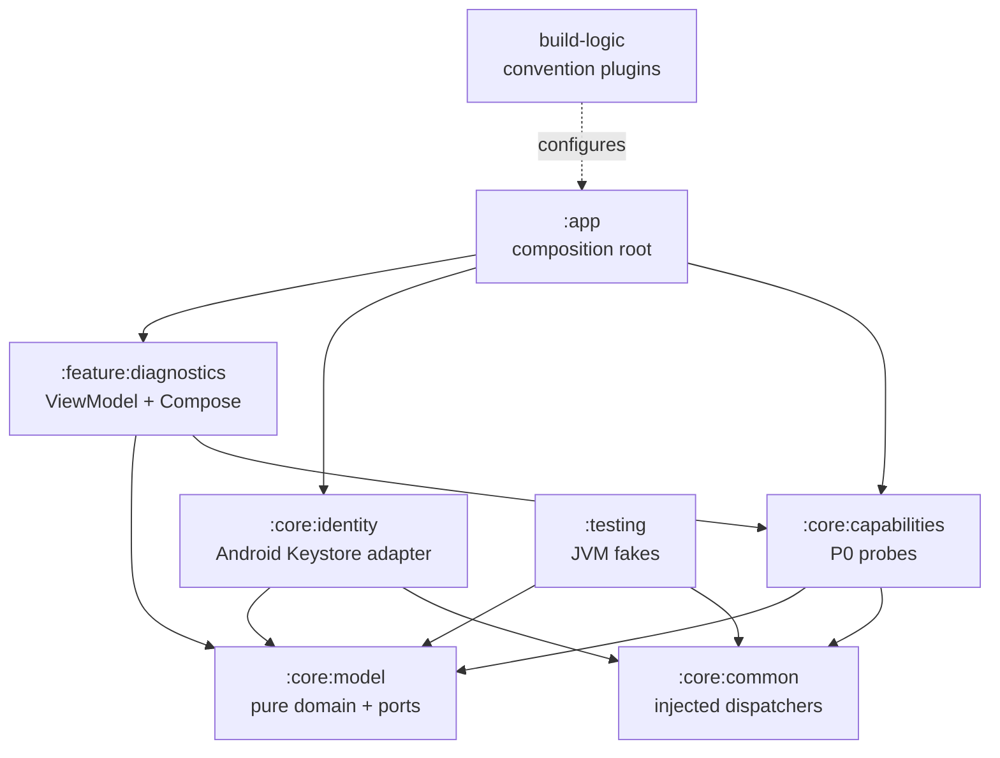

# SpatialLink P1 Cryptographic Device Identity Design

**Date:** 2026-08-27  
**Status:** Approved implementation design for the P1 task  
**Target checkout:** `E:\Projects\R2H-Android\R2H-SpatialLink`  
**Application ID / namespace:** `com.r2h.spatiallink`

## 1. Purpose and scope

P1 adds one stable cryptographic device identity to the completed P0
foundation. The identity is generated and retained by the Android Keystore,
is represented in the pure domain layer by its public material and derived
identifier, and proves possession through ECDSA signatures. Diagnostics shows
the identity status and safe public metadata.

P1 is deliberately bounded. It does not discover peers, establish trust,
store trust decisions, perform key agreement, encrypt transport, pair through
NFC, start a ranging session, transfer files, open a network client, or add any
P2 or later feature. The P0 capability and permission inspection behavior
remains unchanged apart from the addition of a sibling identity inspection in
the diagnostics screen.

## 2. Locked platform and dependency baseline

The implementation preserves the approved P0 baseline:

| Item | Locked value |
| --- | --- |
| Application ID / namespace | `com.r2h.spatiallink` |
| Minimum Android API | 29 |
| Compile Android API | 37 |
| Target Android API | 37 |
| JDK / Java and Kotlin target | 17 |
| Android Gradle Plugin | 9.3.1 |
| Gradle wrapper | 9.5.0 |
| Kotlin | 2.4.10 |
| Compose UI | 1.12.0 |
| Material 3 | 1.4.0 |

The only new production module is `:core:identity`. No `androidx.core.uwb`
dependency is added. Existing dependency versions remain centralized in
`gradle/libs.versions.toml`; no crypto library, DI framework, storage library,
HTTP client, cloud SDK, analytics, or telemetry dependency is introduced.

## 3. Module graph and ownership



Responsibilities remain narrow:

- `:core:model` owns immutable identity domain values, typed identity errors,
  signature results, and the repository port. It has no Android, AndroidX,
  external crypto-provider, Compose, Activity, Context, Keystore, or ViewModel
  dependency. The JDK standard-library SHA-256 implementation used for the
  value-object derivation is not a module dependency or an Android API.
- `:core:identity` owns Android Keystore access, API-guarded security-level
  inspection, P-256 key generation, signing and verification, self-test
  orchestration, and the production repository implementation. Its public
  repository API exposes only `:core:model` values.
- `:core:common` owns injected `default` and `io` dispatchers. Keystore and
  signature operations run on the injected I/O dispatcher.
- `:feature:diagnostics` owns identity presentation state and rendering. It
  calls only the model repository port and performs no crypto or platform
  access from Compose.
- `:app` constructs the production repository with the fixed production alias
  and passes it into the existing diagnostics ViewModel factory.
- `:testing` contains pure Kotlin fakes for diagnostics tests. It never owns
  Android Keystore state.

## 4. Cryptographic contract

The only supported identity algorithm is:

- key type: EC;
- named curve: NIST P-256 / `secp256r1`;
- signature: `SHA256withECDSA`;
- key provider: Android Keystore (`AndroidKeyStore`);
- key purpose: `KeyProperties.PURPOSE_SIGN`;
- user authentication: not required;
- StrongBox: not required and not requested;
- attestation: disabled and not requested;
- production alias: `spatiallink.identity.signing.v1`.

The generator uses `KeyGenParameterSpec` with an `ECGenParameterSpec` for
`secp256r1` and the SHA-256 digest. It does not import a private key and does
not create a software permanent identity key. A valid software-backed
Keystore key is an acceptable result when the platform reports that level.

The repository never exposes, serializes, logs, stores, or returns a private
key. It obtains a private-key handle only inside the Keystore adapter for a
single signing or security-inspection operation. No private-key `encoded`
bytes are used by production code.

## 5. Pure identity domain model

The following values are placed under `:core:model`:

```kotlin
enum class IdentityAlgorithm {
    ECDSA_P256_SHA256,
}

enum class KeySecurityLevel {
    STRONGBOX,
    TRUSTED_ENVIRONMENT,
    SOFTWARE,
    UNKNOWN_SECURE,
    UNKNOWN,
}

enum class IdentitySelfTestStatus {
    NOT_RUN,
    PASSED,
    FAILED,
}

data class IdentityInspection(
    val identity: DeviceIdentity,
    val selfTest: IdentitySelfTestStatus,
)
```

`IdentityFailureCode` contains the typed failure vocabulary:

```text
NOT_FOUND
GENERATION_FAILED
KEYSTORE_UNAVAILABLE
INVALID_KEY_ENTRY
PUBLIC_KEY_UNAVAILABLE
SIGNING_FAILED
RECOVERY_REQUIRED
PLATFORM_FAILURE
```

`IdentityFailure` contains one code and, only where useful, a short safe
detail. It never contains a raw `Throwable`, stack trace, key, signature, or
platform object.

`IdentityRepositoryResult` has three states:

- `Available(IdentityInspection)` means the identity is structurally valid
  and its bounded sign/verify self-test passed.
- `NotCreated` means `get()` found no alias. This is normal and is not an
  error; operations that require an identity may report `NOT_FOUND`.
- `Failed(IdentityFailure)` means the operation could not safely provide an
  identity. Existing invalid state is reported, not silently deleted or
  rotated.

The repository port is:

```kotlin
interface DeviceIdentityRepository {
    suspend fun get(): IdentityRepositoryResult
    suspend fun getOrCreate(): IdentityRepositoryResult
    suspend fun sign(payload: ByteArray): IdentityResult<IdentitySignature>
    suspend fun verify(
        payload: ByteArray,
        signature: IdentitySignature,
    ): IdentityResult<SignatureVerification>
}
```

`get()` never creates. `getOrCreate()` loads a valid existing entry or
generates one entry when the alias is absent. `IdentityResult.Success` and
`IdentityResult.Failure` are the typed result wrapper used by signing and
verification. Verification returns `VERIFIED` or `REJECTED` for a valid
operation; `Failure` is reserved for inability to inspect or verify.

## 6. SpatialDeviceId and public identity values

`SpatialDeviceId` is exactly the 32-byte SHA-256 digest of the public key's
X.509 `SubjectPublicKeyInfo` encoding (`PublicKey.getEncoded()`). The digest
is computed in pure Kotlin/JVM code using `MessageDigest` and no device or
account identifier.

The value object:

- validates the exact 32-byte length;
- copies input bytes during construction;
- returns copies from byte accessors;
- implements content-based equality and hash code;
- provides uppercase, fixed-width, separator-free `canonicalHex()`;
- provides a separate short display form using the first six digest bytes,
  grouped as `XXXX-XXXX-XXXX`;
- does not use UUID, Android ID, serial, IMEI, MAC, Bluetooth address, account,
  model, or manufacturer data.

`IdentityPublicKey` holds only a defensive copy of the encoded public key and
uses content equality. It has no JCA or Android type. `DeviceIdentity` is
immutable and contains only `SpatialDeviceId`, `IdentityAlgorithm`,
`IdentityPublicKey`, and `KeySecurityLevel`. Its invariant is that the ID is
the digest of the contained public-key encoding. It contains no private key,
Keystore reference, mutable buffer, Context, callback, executor, or coroutine
continuation.

The full canonical ID is available only through an explicit diagnostic/test
seam when persistence is qualified. The Compose UI shows the short ID only;
it never displays a private key, full signature, or unnecessary attestation
data.

## 7. Android Keystore boundary

`:core:identity` uses a small injected platform port so repository orchestration
can be tested without replacing the repository with a mock:

```kotlin
data class PlatformIdentityEntry(
    val algorithm: String,
    val isP256: Boolean,
    val encodedPublicKey: ByteArray,
    val securityLevel: KeySecurityLevel,
)

interface IdentityKeyStorePort {
    suspend fun read(alias: String): PlatformIdentityEntry?
    suspend fun generate(alias: String): PlatformIdentityEntry
    suspend fun sign(alias: String, payload: ByteArray): ByteArray
    suspend fun verify(
        encodedPublicKey: ByteArray,
        payload: ByteArray,
        signature: ByteArray,
    ): Boolean
}
```

The production `AndroidKeyStorePlatformAdapter`:

1. opens the `AndroidKeyStore` provider and loads it with a null password;
2. treats a missing alias as `null` and never generates during `read`;
3. requires an Android Keystore `PrivateKeyEntry` and a certificate public
   key;
4. validates EC/P-256 structure and a nonempty encoded public key;
5. maps the key security level through the API-aware inspector;
6. generates directly in the provider with the locked `KeyGenParameterSpec`;
7. loads the private handle only locally for `SHA256withECDSA` signing. The
   key is AndroidKeyStore-backed; the JCA signature lookup intentionally uses
   the platform default selection because API 34 does not expose this
   algorithm by name through the `AndroidKeyStore` provider;
8. verifies signatures with the encoded public key and never private bytes.

No method deletes the production alias. Invalid existing material produces a
typed failure and leaves the entry untouched.

### Security-level mapping

The API guard is split into dedicated source files:

- On API 31+, `Api31KeySecurityLevelReader` calls the typed
  `KeyInfo.getSecurityLevel()` API and maps the platform constants to
  `STRONGBOX`, `TRUSTED_ENVIRONMENT`, `SOFTWARE`, or `UNKNOWN`.
- On API 29–30, `LegacyKeySecurityLevelReader` calls the typed legacy
  `KeyInfo.isInsideSecureHardware` signal. `true` maps to
  `UNKNOWN_SECURE`, because the legacy signal does not distinguish StrongBox
  from the trusted environment; `false` maps to `SOFTWARE`.
- Any inspection failure maps to `UNKNOWN` while preserving a structurally
  valid identity. Security level never controls whether the identity is
  valid or whether diagnostics is `READY`.

The API 31 reader is invoked only after `Build.VERSION.SDK_INT >= 31`. No
reflection or string-based class loading is used.

## 8. Repository lifecycle, concurrency, and recovery

`AndroidKeyStoreIdentityRepository` uses one coroutine `Mutex` for every
alias-scoped read/create/sign/verify operation. `getOrCreate()` performs its
missing check and generation while holding the mutex, so concurrent callers
can cause at most one generation. It does not use `GlobalScope`, raw threads,
ad-hoc executors, `runBlocking`, or an unbounded main-thread operation.

The repository executes Keystore and JCA work on the injected `io` dispatcher.
Cancellation is rethrown at every suspend boundary. No coroutine continuation
or callback is retained after an operation returns.

The load/create sequence is:

1. read the fixed or explicitly test-scoped alias;
2. return `NotCreated` from `get()` when absent;
3. for `getOrCreate()`, generate exactly once only when absent;
4. validate alias entry type, EC/P-256 algorithm, public encoding, and derived
   ID;
5. run a bounded random challenge sign/verify self-test without persistence;
6. return `Available` only after the self-test passes;
7. map failures to typed codes without deleting or silently replacing the
   existing entry.

An existing structurally invalid entry maps to `INVALID_KEY_ENTRY` or
`PUBLIC_KEY_UNAVAILABLE`. An existing key that cannot pass the self-test maps
to `RECOVERY_REQUIRED`. Generation and provider failures map to
`GENERATION_FAILED`, `KEYSTORE_UNAVAILABLE`, `SIGNING_FAILED`, or
`PLATFORM_FAILURE` according to the failed boundary. A valid identity does not
require StrongBox and is not blocked by a `SOFTWARE` security level.

Test aliases have the form `spatiallink.test.identity.<unique>`. Instrumented
cleanup deletes only the alias created by that test. It never deletes the
production alias, clears app data, uninstalls the app, or mutates unrelated
device state.

## 9. Signing and verification behavior

`sign(payload)` returns an `IdentitySignature` containing the fixed algorithm
and a defensive copy of the DER ECDSA signature bytes. It first confirms that
the configured alias is present and structurally valid, then signs the exact
payload. It does not assume deterministic ECDSA; repeated signatures may
differ while both verify.

`verify(payload, signature)` validates the stored public identity and checks
the supplied algorithm and signature through `SHA256withECDSA`. The original
payload must return `VERIFIED`; a modified payload must return `REJECTED`.
Invalid or modified signatures do not cause key rotation.

The self-test uses a fresh `SecureRandom` challenge, signs it, verifies it
with the derived public key, and discards both challenge and signature. It
does not persist or log either value.

## 10. Diagnostics integration

The existing diagnostics inspection gains an injected
`DeviceIdentityRepository` sibling. The ViewModel runs capability, permission,
and identity inspection in structured sibling jobs. A typed identity failure
does not erase successful capability or permission results, and an unexpected
identity exception becomes a typed `IdentityInspectionFailed` UI error rather
than a raw exception.

The identity UI model contains:

- `LOADING`;
- `READY`;
- `NOT_CREATED`;
- `UNAVAILABLE`;
- `RECOVERY_REQUIRED`;
- `ERROR`.

The screen adds a bounded **Device identity** section containing identity
status, short Spatial ID, algorithm, key protection, and self-test status.
Security level and identity validity are independent rows. Status text remains
readable in narrow layouts using the existing weighted, right-aligned status
row pattern. Compose performs no Keystore, JCA, permission, networking, or
platform operations.

Identity creation/loading is triggered by the ViewModel's inspection through
`getOrCreate()`. It does not request a runtime permission or show a startup
permission dialog. A production alias remains stable across process/activity
recreation and ordinary app relaunch. App-data clear, uninstall, and device
replacement continuity are not promised and are not used as P1 qualification
steps.

Backup remains disabled by the existing P0 manifest rules. No private key is
placed in app storage or backup data.

## 11. Test-first verification strategy

### Pure JVM domain and policy tests

`:core:model` tests cover:

- SHA-256 derivation from a hand-checked public-key encoding;
- exact 32-byte ID length and canonical uppercase hex;
- short display formatting;
- defensive input/output byte copies;
- content equality/hash behavior;
- `DeviceIdentity` ID/public-key invariant;
- signature defensive immutability;
- identity error/status mapping policies.

### Repository orchestration tests

`:core:identity` JVM tests use an injected `IdentityKeyStorePort` fake only at
the platform boundary and exercise the real repository. They cover:

- `get()` reports missing without generating;
- `getOrCreate()` generates once and returns a stable identity;
- an existing entry is loaded rather than regenerated;
- malformed existing entries fail without deletion or rotation;
- generation failures map to typed errors;
- self-test success and self-test failure;
- signing and verification including modified-payload rejection;
- concurrent `getOrCreate()` callers observe one generation;
- cancellation and typed platform failure behavior.

### Connected Android Keystore tests

On the authorized physical device, instrumentation uses only a unique test
alias. It verifies real generation, load, stable ID, repository recreation,
sign/verify, modified-payload rejection, private-key non-exportability through
the normal `PrivateKey.encoded == null` observation, security-level mapping,
concurrent callers, and cleanup of only the test alias. It never logs or
serializes private material and never deletes the production alias.

### App qualification

The debug APK is installed and launched without an emulator. The test records
the Android/API/ABI metadata, diagnostics identity rows, a safe full canonical
ID from the injected instrumentation seam, and the self-test result. It
force-stops and relaunches the app without clearing data, then confirms the
canonical ID is unchanged. It checks logcat for fatal/class-loading/Keystore/
security exceptions and confirms no startup permission request.

## 12. Security, privacy, and scope gates

The final review must find no:

- Android or AndroidX dependency in `:core:model`;
- `androidx.core.uwb`, Bouncy Castle, Tink, libsodium, Firebase, Retrofit,
  OkHttp, Ktor, Hilt, Dagger, Koin, Room, SQLDelight, protobuf, ONNX, or ML
  dependency;
- reflection or dynamic class loading;
- persistent device identifier, MAC/address read, serial/IMEI/Android ID,
  account access, or personal-data access;
- private-key serialization, logging, storage, or transport;
- attestation request, StrongBox requirement, software-key import, key
  agreement, or deterministic-ECDSA assumption;
- production-alias delete/rotate path or test-alias leakage;
- startup runtime permission request or new dangerous permission;
- peer discovery, transfer, NFC pairing, ranging session, transport, cloud,
  WAN, analytics, telemetry, or P2+ implementation.

The source review must also confirm that no crypto work is performed from
Compose or the main thread, and that cancellation and exception conversion
are explicit.

## 13. Acceptance gates

P1 is complete only when all applicable gates have fresh evidence:

1. the P1 design and implementation plan are present and self-reviewed;
2. all JVM tests pass, including new model and repository tests;
3. debug and release APK builds pass;
4. lint passes;
5. connected instrumentation actually executes and passes on the authorized
   physical device;
6. the current debug APK installs and launches with no startup permission
   dialog;
7. diagnostics shows `READY` or an allowed typed partial state and the
   identity section reports a valid result;
8. the production identity remains stable across non-destructive relaunch;
9. real Keystore signing verifies the original payload and rejects a modified
   payload;
10. private-key non-exportability is observed through normal APIs;
11. logcat contains no unresolved SpatialLink fatal, class-loading, Keystore,
    provider, invalid-key, security, or illegal-state exception;
12. the architecture/privacy/scope scan remains clean;
13. no API 36/37 physical execution is required for P1 completion, but the
    API-guarded source must compile and the adapter must remain isolated.

The final report must distinguish direct physical evidence, connected test
evidence, JVM/build evidence, and static inspection. It must end with exactly
one of `P1_IDENTITY_COMPLETE` or `P1_IDENTITY_BLOCKED`.

## 14. Explicit exclusions

The following remain outside P1 and are not started by this implementation:

```text
P2  BLE Peer Discovery
P3  Secure Peer Handshake
P4  High-Speed Local Transport
P5  Chunked Resumable Transfer
P6  NFC Physical Trust
P7  Android Spatial Ranging Sessions
P8  Point-to-Device Targeting
P9  Smart Capsules
P10 Local Semantic Index
P11 Semantic Share / Smart Pull
P12 Multi-Device Spatial Workspace
P13 Local Swarm Transfer
```
